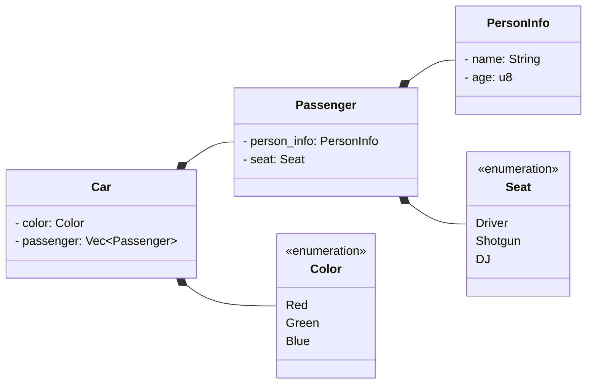

```mermaid
classDiagram
direction LR
class Car {
    - color: Color
    - passenger: Vec~Passenger~
}
class Passenger {
    - person_info: PersonInfo
    - seat: Seat
}
class PersonInfo {
    - name: String
    - age: u8
}
class Color {
<<enumeration>>
    Red
    Green
    Blue
}
class Seat {
<<enumeration>>
    Driver
    Shotgun
    DJ
}
Car*--Passenger
Car*--Color
Passenger*--PersonInfo
Passenger*--Seat
```