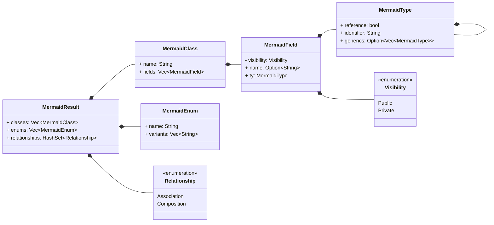

```mermaid
classDiagram
direction LR


```

```mermaid
classDiagram
direction LR
class MermaidResult {
    + classes: Vec~MermaidClass~
    + enums: Vec~MermaidEnum~
    + relationships: HashSet~Relationship~
}
class MermaidType {
    + reference: bool
    + identifier: String
    + generics: Option~Vec~MermaidType~~
}
class MermaidClass {
    + name: String
    + fields: Vec~MermaidField~
}
class MermaidField {
    - visibility: Visibility
    + name: Option~String~
    + ty: MermaidType
}
class MermaidEnum {
    + name: String
    + variants: Vec~String~
}
class Relationship {
<<enumeration>>
    Association
    Composition
}
class Visibility {
<<enumeration>>
    Public
    Private
}
MermaidClass*--MermaidField
MermaidField*--MermaidType
MermaidField*--Visibility
MermaidResult*--MermaidClass
MermaidResult*--MermaidEnum
MermaidResult*--Relationship
MermaidType*--MermaidType
```